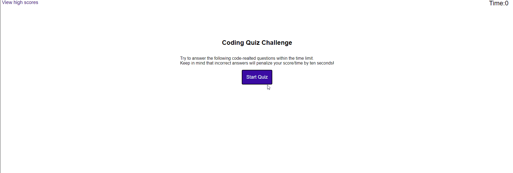
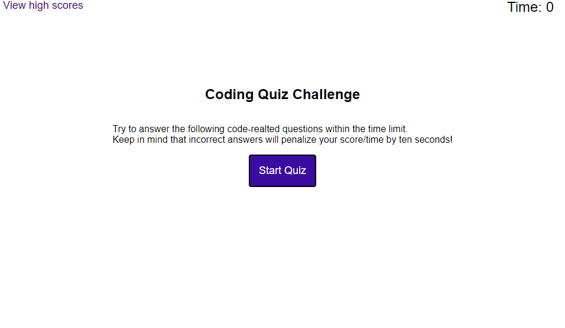
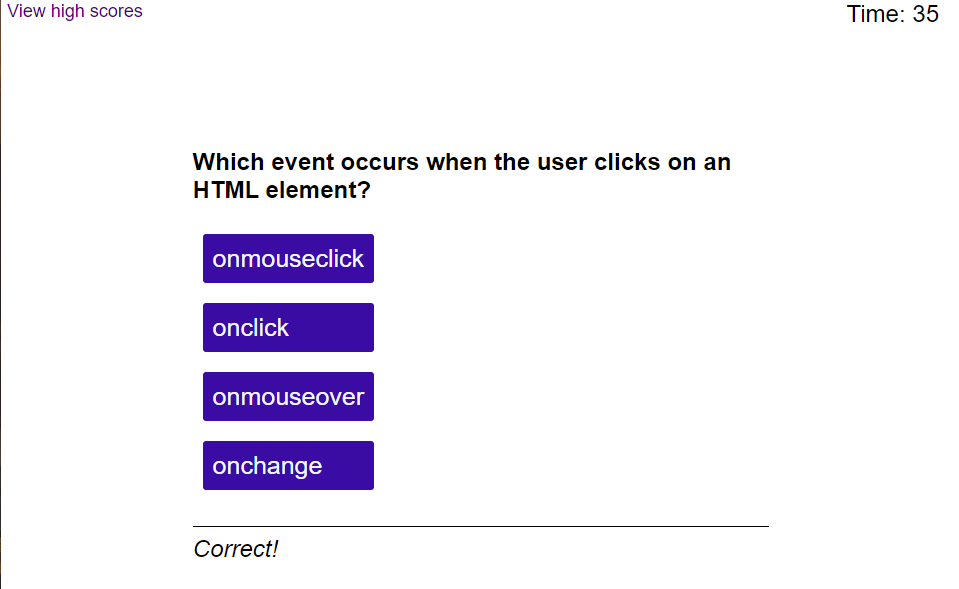
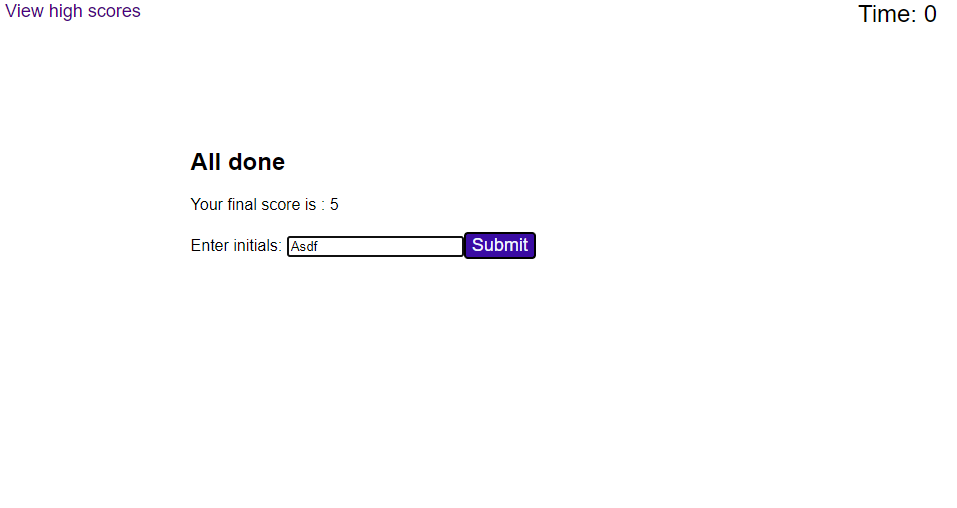
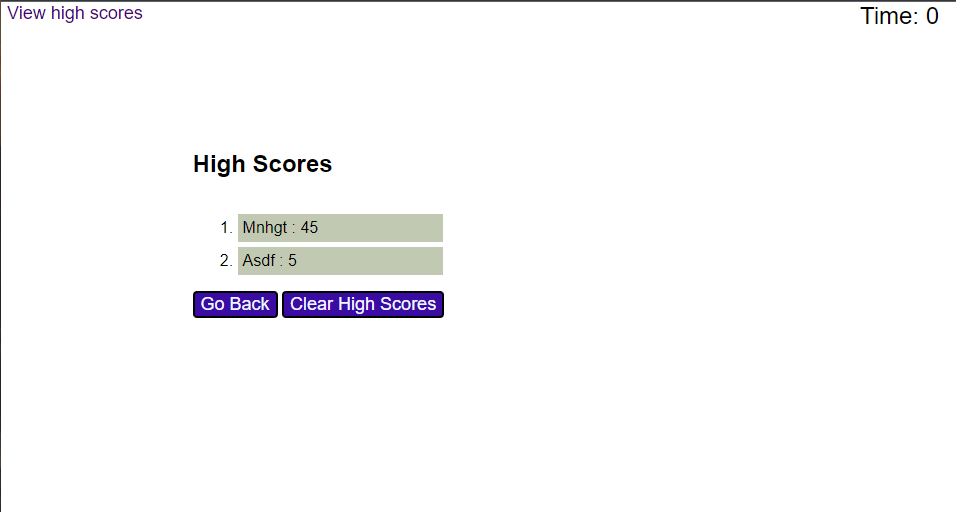

# Code Quiz

# A typical coding assessment with multiple-choice questions 

Code Quiz is an application which was assigned as the homework for week 4 of Monash University Bootcamp.

This Challenge invites to build a timed coding quiz with multiple-choice questions where the user will be rewarded with five points for each correct answer and take away 10seconds for each wrong answer, for a 60seconds challenge 

This app will run in the browser and will feature dynamically updated HTML and CSS powered by JavaScript code. It has a clean and polished, responsive user interface that adapts to multiple screen sizes

## Getting Started

This project has been deployed to GitHub Pages. To get this project up and running, you can follow the deployment link. Or download the sources files to use this as a template.

Git Hub 

* [GitHub Repository] (https://github.com/gopinathkk/Code-Quiz.git )
* [Deployed GitHub] ( https://gopinathkk.github.io/Code-Quiz/)
* [Full Demo Video] (https://drive.google.com/file/d/15xy61lyKLYiInS6ZeBHtqQAJ3UsJy5FF/view)

The following animation demonstrates the application functionality:

### Prerequisites

To install this application, you will need a text editor. I recommend Visual Studio Code. 

### Installing

To install this code, download the zip file, or use GitHub's guidelines to clone the repository. 

### Summary
* HTML and CSS and JavaScript documents create a quiz for coding skill assessment 
* This project emphasizes the use of HTML DOM Element Web API to make dynamic changes to an HMTL document

### This project has the following features: 
    * A start buttons
    * This will open a screen with multiple choice questions
    * Quiz time will be 60 seconds
    * User can choose the answers by clicking the labels
    * If the answer is correct five points will be awarded 
    * Ten seconds penalty is applicable for a wrong answer

    

    * When the time period end, final score will be displayed
    * There will be an option to record the score and user's initials

    

    * The user scores can be viewed by "view high score" button
    * High score lists can be deleted using "reset high score" button  

    

    * The high score entries will be saved in the local storage
    * "Reset High Score" button will delete the saved list from local storage

    

### Psuedo Code and Project Requirements: 

* GIVEN I am taking a code quiz
* WHEN I click the start button
* THEN a timer starts, and I am presented with a question
* WHEN I answer a question
* THEN I am presented with another question
* WHEN I answer a question incorrectly
* THEN time is subtracted from the clock
* WHEN all questions are answered, or the timer reaches 0
* THEN the game is over
* WHEN the game is over
* THEN I can see my score and save my initials and score

### This project has script features of:
* Single HTML file with four sections. Each section display is enabled from JavaScript code
* Variable declaration area and Web APIs
* Event listeners 
* Start button clicked:
   - a start variable switched ON
   - a timer starts
   - a function is called to select the questions randomly from a list of questions 
   - an array of objects used for storing questions
   - a function starts to check if the user selected answer is correct
* When the user clicks an answer:
   - a function checks the answer
   - if the answer is correct, five points added to score
   - if the answer is wrong, 10 seconds deducted from timer
   - next question presented to user
   - this sequence continue till the time ends
* When the time ends:
   - the start variable switched off.
   - final score will be displayed
   - a test entry input box with submit button is presented
   - if the user enters his initials, score send initials will be saved to local     storage using an array.
   - if no initials entered, user scores will not be stored
* When the user press submits:
   - the list of user entries is presented
   - when "go back" button pressed, the main page with start button will be presented.
   - when the "reset high score" button pressed the high score list will be deleted
* The user can view high score anytime during or after the quiz period.

### To Execute File:
> Open in browser

### Features: 
One HTML Pages
    * index.html 
        - Contains basic user input items and buttons with divs and ids
        - Contains four sections- acts as four different screens
* One CSS Page
    * styles.css
        * Contains cantering and styling for html user input features

        
* One Javascript Page
    *app.js
        - Contains: 
        - Variables, including arrays and value placeholders
        - Event listeners
        - if/else if statements
        - Function to select questions from an array of objects
        - Functions to verify answers
        - Function to set timer
        - Function to countdown timer
        - Function to create an ordered list of initials and scores
        - Functions to play an alert sound
        - An array of objects to store the questions

## Authors
***Gopinath Krishnankutty [Git Hub Profile]https://github.com/gopinathkk
* Monash Univeristy :© 2022 Trilogy Education Services, LLC, a 2U, Inc. brand. Confidential and Proprietary. All Rights Reserved.

